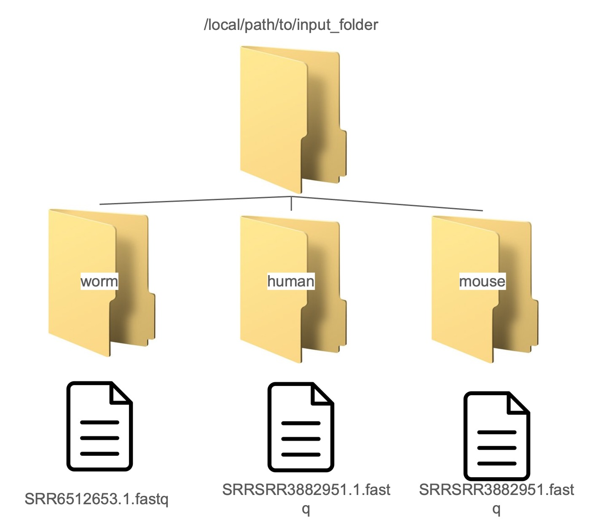
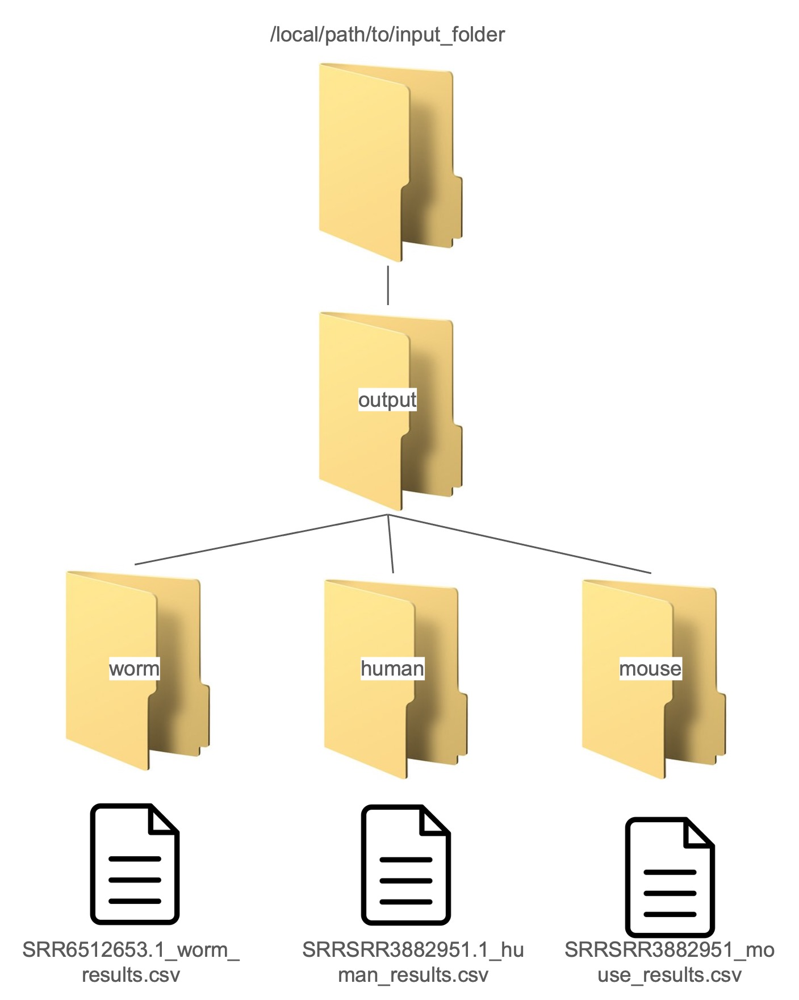

# *miRTarCLASH*: mirTarCLASH: a comprehensive miRNA target database based on chimeric read-based experiments


### Related paper:

Tzu-Hsien Yang, Xiang-Wei Li, Yuan-Han Lee, Shang-Yi Lu, Wei-Sheng Wu3\*, and Heng-Chi Lee\*, "mirTarCLASH: a comprehensive miRNA target database based on chimeric read-based experiments," (Under Review)

## Start the Environment

We recommend using Docker to set up the necessary environments for the simplified CLASH analysis pipeline used in miRTarCLASH. 

Here is an example: 

1. Install the Docker software. If you have already installed the Docker software, please skip this step. 

If you are using Microsoft Windows systems, please follow the instructions <a href="https://docs.docker.com/desktop/install/windows-install/">here</a>.

If you are using Mac OS systems, please follow the instructions <a href="https://docs.docker.com/desktop/install/mac-install/">here</a>.

2. Start the Docker program by double-clicking the Docker icon.

***
Please do not stop the Docker program during the execution of the web service.
***

3. Open the command line interface of your system and type

```
docker pull cosbincku/mirtarclash

```

to get the latest version of the simplified CLASH analysis pipeline.

4. Put the fastq files in a folder. In this simplified analysis pipeline, 3 species (human, mouse, and worm) are supported for read mapping. Please organize your fastq files in the folders named human/mouse/worm in this folder.  



5. Start the analysis process by typing in the follwoing instruction in the terminal:


```
docker run --rm --name mirtarclash -v [your folder name]:/media -it cosbincku/mirtarclash /bin/bash -c "bash run_analysis.sh"

```

Remember to replace [your folder name] by the real folder where you put the fastq files. 

6. After finishing the analysis, the results will be arranged in the following folder structure:



## Some Test Examples

We have prepared some example fastq files of various sizes for you to test this pipeline:

1. SRR2413282.fastq (mouse): 863MB
[Link](https://cosbi.ee.ncku.edu.tw/MirTarClash/downloadfastq/SRR2413282.fastq.gz/)

2. SRR3882728.fastq (worm): 1.3GB 
[Link](https://cosbi.ee.ncku.edu.tw/MirTarClash/downloadfastq/SRR3882728.fastq.gz/)

3. SRR3882951.fastq (worm): 5.9GB 
[Link](https://cosbi.ee.ncku.edu.tw/MirTarClash/downloadfastq/SRR3882951.fastq.gz/)

4. SRR959759.fastq (human): 3.5GB
[Link](https://cosbi.ee.ncku.edu.tw/MirTarClash/downloadfastq/SRR959759.fastq.gz/)

5. SRR959754.fastq (human): 956MB 
[Link](https://cosbi.ee.ncku.edu.tw/MirTarClash/downloadfastq/SRR959754.fastq.gz/)


## Some Possible Issues

Here, we collect some common issues users may encounter when using this simplied CLASH analysis pipeline:

Case (1): memory issue.

```
Detected 'killed', stopping script execution.(memory is not enough)
```
Solution: 

Please use a computer with a larger memory capacity. 
